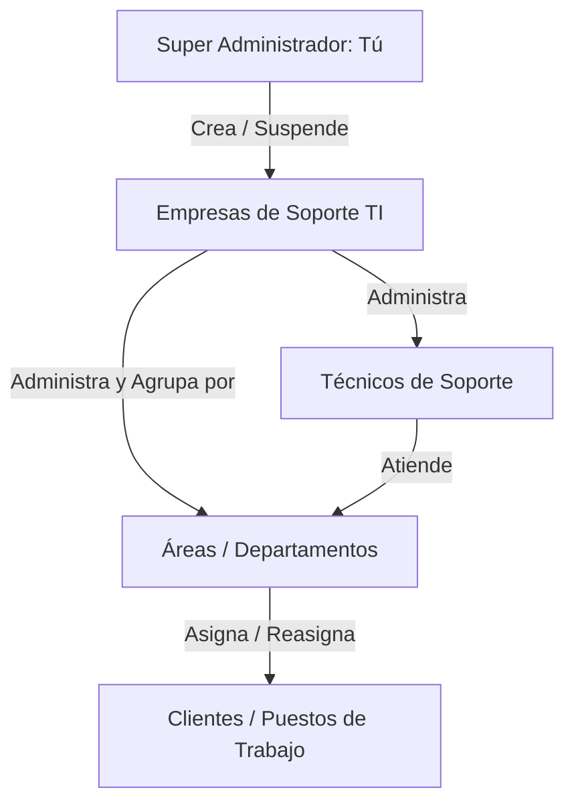

# Planteamiento de Arquitectura y Seguridad Comercial: SercomDesk v5.0

## 🎯 Visión del Producto
Transformar **SercomDesk** de una herramienta interna a una plataforma de soporte remoto comercializable para empresas de TI. El ecosistema mantendrá un **Agente Cliente extremadamente ligero (~93 KB)**, delegará la administración a una **App de Técnico Multiplataforma en PyQt6** compilada a binario cerrado (Nuitka), y centralizará el control en un modelo jerárquico multi-inquilino.

---

## 🏗️ 1. Seguridad de Código: Compilación y Ofuscación (Nuitka)
Para evitar la distribución de código Python en texto plano en la aplicación del técnico, el flujo de empaquetado convertirá el código a binario cerrado de lenguaje C/C++:

* **Traducción y Compilación con Nuitka:** 
  Nuitka traduce el código fuente Python (`.py`) directamente a instrucciones C++ y lo compila como un ejecutable nativo (ELF en Linux, `.exe` en Windows) a través de compiladores del sistema (`GCC` / `MSVC`).
* **Protección de Datos Sensibles (Cifrado de Constantes):** 
  Las URLs de los servidores WebSocket, las firmas criptográficas y las claves API se inyectan en tiempo de compilación y se protegen en memoria, impidiendo que escáneres de texto plano o desensambladores simples revelen la infraestructura de SERCOM.

---

## 🛡️ 2. Control de Acceso Jerárquico (RBAC) y Áreas de Trabajo

La base de datos central en **SV1** estructurará la jerarquía comercial para aislar el tráfico de diferentes empresas y permitir la clasificación de equipos:



### Definición de Roles y Permisos:
1. **Super Administrador (Tú):**
   * Control global sobre la infraestructura del servidor.
   * Único perfil capaz de **dar de alta, suspender y facturar a Empresas de Soporte TI**.
   * Acceso a auditorías de conexión global y control de licencias activas.
2. **Administrador de Empresa (Cliente Comercial de TI):**
   * Gestiona su propia organización en la plataforma.
   * Puede **dar de alta, modificar y dar de baja a sus Técnicos**.
   * Gestiona todos los equipos enlazados a su organización desde el panel general de la empresa.
   * **Asigna y reasigna los equipos** a técnicos o áreas de trabajo específicos de forma dinámica.
   * Crea y administra **Áreas / Departamentos** (ej. *Soporte de Servidores*, *Redes*, *Ventas*).
3. **Técnico:**
   * Accede a la **App del Técnico (PyQt6)** con sus credenciales individuales.
   * Visualiza y controla únicamente los **Puestos de Trabajo** pertenecientes a las áreas a las que está asignado o que le han sido asignados directamente por su administrador.
   * Sus acciones sobre el cliente (Ver pantalla, Controlar mouse/teclado, Enviar comandos Powershell, Transferencia de archivos) están regidas por los **permisos granulares** configurados por su Administrador.

---

## 🔑 3. El Flujo de Enlace Inteligente y Auto-Actualización Dinámica

El cliente conserva su ligereza y su ID único para autodetección, pero su asignación y comportamiento de red se controlan dinámicamente desde el servidor:

```text
[ Cliente abre SercomSoporte.exe ]
          │
          ├──> 1. Genera su ID de soporte (ej. 8122-8714)
          │
          └──> 2. Petición HTTP /soporte/client-config al Servidor
                    │
                    ├──> Lee el mapeo actual en la Base de Datos (SV1):
                    │    * Empresa asignada (ej: Empresa ID 14)
                    │    * Área asignada (ej: Soporte de Servidores)
                    │    * Técnico asignado (ej: Técnico ID 102)
                    │
                    └──> Retorna la configuración de políticas y visibilidad.
```

### 🔄 Mecanismo de Auto-Actualización de Asignación:
* **Sin Intervención del Cliente Final:** El cliente final no tiene que cambiar de ID ni configurar nada. Si el **Administrador de la Empresa** reasigna el puesto de trabajo (ej. del área de *Soporte Nivel 1* a *Soporte de Servidores*), el servidor actualiza el registro en la base de datos de inmediato.
* **Sincronización en Tiempo Real:** 
  Al recibir el cambio en el servidor, si el agente está en línea mediante WebSocket, se le envía un comando de reconfiguración silencioso. Si no, en su siguiente ciclo de Poll HTTP, el agente lee su nueva asignación y políticas actualizadas (ej: quién puede controlarlo).

---

## 🚀 4. Plan de Acción y Hoja de Ruta de Desarrollo

### 🔹 Fase 1: Construcción de la App del Técnico (PyQt6)
1. **Desarrollo del Viewer nativo:** Crear la interfaz nativa PyQt6 en Python que consuma el flujo de WebSockets binarios de v4.0.0 a máxima velocidad utilizando la GPU (`QOpenGLWidget` / `QPainter`).
2. **Implementación de Entrada de Control:** Captura de eventos de mouse y teclado nativos en Linux/Ubuntu para enviar los comandos al agente remoto.
3. **Prueba de compilación Nuitka:** Compilar y empaquetar el viewer de Python a binario ELF de Linux.

### 🔹 Fase 2: Motor Jerárquico, Áreas y Base de Datos en SV1
1. **Esquema Relacional Ampliado:** Crear tablas `empresas`, `areas_departamentos`, `usuarios_tecnicos`, `dispositivos_clientes` (con campos `empresa_id`, `area_id` y `tecnico_id`) y `sesiones_auditoria`.
2. **Endpoints de Administración:** APIs para que el Administrador de Empresa cree áreas y cambie la asignación de los dispositivos de forma dinámica.
3. **Endpoints de Control:** Implementar control de jerarquías en `/soporte/agentes`, impidiendo que un técnico consulte o envíe comandos a un ID que no pertenezca a su empresa o área asignada.

### 🔹 Fase 3: Integración de PIN y Enlace en el Agente de Windows
1. **Políticas Dinámicas en el Agente:** Actualizar el agente cliente de Windows Forms para consultar su pertenencia y aplicar las políticas dictadas por la base de datos de forma dinámica.
